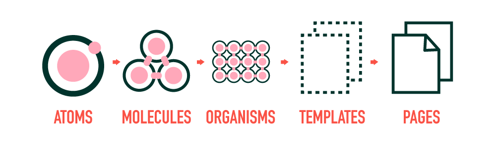

# Vueについて

## 目次

- [Vueの特徴](#vueの特徴)
- [Vueを動かす環境](#vueを動かす環境)
- [SPA(シングルページアプリケーション)](#spaシングルページアプリケーション)
- [SFC(単一ファイルコンポーネント)](#sfc単一ファイルコンポーネント)
- [Atomic Design](#atomic-design)
- [OptionsAPIとCompositionAPI](#optionsapiとcompositionapi)
- [仮想DOM](#仮想dom)
- [リアクティビティー](#リアクティビティー)
- [ライフサイクルフック](#ライフサイクルフック)

## Vueの特徴
- **宣言的レンダリング**
  - Vue では、標準的な HTML を拡張したテンプレート構文を使って、HTML の出力を宣言的に記述することができます。この出力は、JavaScript の状態に基づきます。

- **リアクティビティー**
  - Vue は JavaScript の状態の変化を自動的に追跡し、変化が起きると効率的に DOM を更新します。

## Vueを動かす環境

### Vueを動かすために必要なもの

- コンパイラ
- バンドル
- ランタイム
- ビルド

### ツール

- node.js
- vite
- webpack

### ランタイム
- 実行環境ともいう。
- Vue インスタンスの作成やレンダリング、仮想 DOM の変更などのためのコード。基本的にコンパイラを除く全てのもの。
- Vueの場合はブラウザ上で動作するので、ブラウザがランタイムの機能を持っているといえる。

### コンパイラ

## SPA(シングルページアプリケーション)

- **SPAとは**
  - 最初に画面を開いた際にルートとなるHTMLと画面表示に必要なライブラリ等を全てダウンロードする
  - 以降のHTMLの更新は全てブラウザで行う
  - サーバーサイドとの通信はJSONでデータのみのやり取りを行う
  
- **メリット**
  - 画面更新時にHTMLを作り直す必要がなく、変化させたい部分だけ更新すればよいので、画面表示速度が早い。
  - データ通信時も画面全体が切り替わることがないので画面が白くならない
 - **デメリット**
   - 初回にブラウザに必要なものを全てダウンロードする必要があるため、初回の起動が遅い
   - 画面が切り替わらないのでSEO的に不利

## SFC(単一ファイルコンポーネント)
 - **SFCとは**
   - Vueが採用しているファイルの形式
   - テンプレートとなるHTML、スタイルのCSS、ロジックのJavaScriptを一つのファイルの収めたもの
   - このファイルからHTMLを作り上げるのをビルドといい、その機能を持つものをビルドツールという。
   - Vue3の場合はviteというビルドツールを採用している

## Atomic Design

- アトミックデザインとは、UIデザインにおける設計手法の一つであり、画面を粒度によって区別された「コンポーネント」と呼ばれる単位で分け、コンポーネントを組み合わせて画面を構成するという考え方。
- この方法でVueのコンポーネント設計を考えることが多い。

### 一般的なAtomic design

||
|:--:|

| 段階 | 内容 | UI例 |
| :--: | :--: | :--: |
| Atoms | これ以上分けられない単位 | ボタン・テキスト入力欄・ラベル |
| Molecules | Atoms が複数組み合わさったもの | 入力フォーム  （ラベル＋入力欄） |
| Organisms | １つの明らかな機能を持つ | ヘッダー |
| Templates | ページの枠組みを構成する | ワイヤーフレーム |
| Pages | ページにコンテンツを入れたもの | デザインカンプ |

(参考)[Atomic Design ベースの Vue コンポーネント設計](https://qiita.com/d2cid-kimura/items/4aee84da42131f40b808)

- 上記がAtomic designで提唱された構成だが、コンポーネントの粒度は作成する画面に応じて設定すると良い

## OptionsAPIとCompositionAPI

- **OptionsAPI**
  - Vue2まで採用されていたVueファイルのscriptの書き方
  - data, methodなどのオプションからなるオブジェクトを生成するオブジェクト指向に近い考え方
  - dataに対してオブジェクト内でアクセスする場合にはthis.が必要
  - dataに対する操作をコンポーネント内で行う必要があるため、コードが大きくなりがち
  - オプションごとに記述する必要があるため、機能ごとの関連性が分かりずらい

- **CompositionAPI**
  - Vue3から導入された記法
  - これまで書いていたdata, methodなどを全て関数で定義し、それを公開することで使用する関数型プログラミング
  - 関数の組み合わせで処理を書いていくため、自由度が高い
  - 機能ごとにまとめて書くこともできるため、コンポーネントが巨大になっても整理しやすい

[サンプルコード][1]

[1]: ../vue3-demo/src/components/ApiDemo.vue

## リアクティビティー

- 

### ref()による状態の変化とDOMの更新

- 

## ライフサイクルフック

### ライフサイクルダイアグラム

||
|:--:|

### CompositionAPIの場合のライフサイクル

- **setUp**
  - setUp関数内の処理が実行される。
  - データや公開される関数が準備される

- **Mounted**
  - VueインスタンスがDOM要素にマウントされる
  - =>SFCを解釈してHTMLが作成される
  - マウントが完了した段階でユーザーに画面が表示される
  - 子コンポーネントは親コンポーネントより先にマウントが完了する

- **Update**
  - コンポーネント内のリアクティブなデータが更新される
  - データの更新によってマウントされているHTMLが更新されて表示画面が変わることを再レンダリングという

- これらのライフサイクルの各イベントの前後にライフサイクルフックと呼ばれるAPIが用意されており、その時点で行う処理を記述することができる。

[サンプルコード][2]

[2]: ../vue3-demo/src/components/ApiDemo.vue

## まとめ

- ここでは主に重要な概念について簡単に解説しています。
- さらにVue公式のドキュメントやそれぞれの用語について詳しく調べることでVueの理解が深まると思います。
- サンプルのプロジェクトは自由にクローン、フォークしてお使いください。